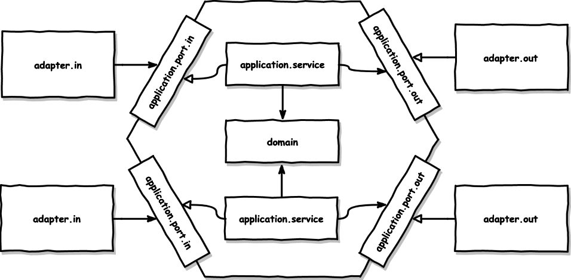

# 🤿 대용량 트래픽 Deep Dive 

## What is Flitter?
팔로워가 100만명인 유저가 있는(것을 가정한) SNS 서비스이다. 대용량 트래픽을 처리하고, 특히 동시성 제어에 대한 고민과 학습이 주된 목표이다.

## Architecture
이 프로젝트는 아래의 목적을 가지고 헥사고날 아키텍처(Hexagonal Architecture)를 바탕으로 설계되었다.

1. 외부 시스템과 인프라와의 의존성을 낮춘 유연한 애플리케이션 구현
2. 비즈니스와 기술을 분리
3. 유스케이스를 통해 손쉬운 핵심 비즈니스 이해
4. 안정적인 테스트

### 헥사고날 아키텍처(Hexagonal Architecture)

* 이 아키텍처의 주요 목표는 응용 프로그램의 비즈니스 로직을 외부 세계로부터 격리시켜 유연하고 테스트하기 쉬운 구조를 만드는 것
* 핵심 비즈니스 로직은 중앙의 도메인 영역에 위치하며, 입력과 출력을 처리하는 포트와 어댑터를 통해 외부와 소통함
* 때문에 포트와 어댑터 아키텍처(Ports and Adapters Architecture)라고도 불림

### Hexagonal Architecture in Flitter 🤔

이 프로젝트에서는 각 컴포넌트를 루트 패키지(`dev.hoon.deepdive.heavytraffic.flitter`) 하위에 패키지 단위로 구분하고 있다.

#### [`adapter`](flitter/src/main/kotlin/dev/hoon/deepdive/heavytraffic/flitter/adapter)
외부 영역에 해당하며, 애플리케이션 코어를 호출하는 어댑터([`adapter.in`](flitter/src/main/kotlin/dev/hoon/deepdive/heavytraffic/flitter/adapter/in) 패키지 하위 클래스)와 애플리케이션 코어에 의해 호출되는 어댑터([`adapter.out`](flitter/src/main/kotlin/dev/hoon/deepdive/heavytraffic/flitter/adapter/out) 패키지 하위 클래스)가 있다. 
#### [`application`](flitter/src/main/kotlin/dev/hoon/deepdive/heavytraffic/flitter/application)
어댑터와 애플리케이션의 통신을 담당하는 포트([`application.port`](flitter/src/main/kotlin/dev/hoon/deepdive/heavytraffic/flitter/application/port))와 핵심 비즈니스 로직을 구현하는 서비스([`application.service`](flitter/src/main/kotlin/dev/hoon/deepdive/heavytraffic/flitter/application/service))로 구성되어있다.
포트는 [`in`](flitter/src/main/kotlin/dev/hoon/deepdive/heavytraffic/flitter/application/port/in)/[`out`](flitter/src/main/kotlin/dev/hoon/deepdive/heavytraffic/flitter/application/port/out)으로 나뉘어있는데 각각 유스케이스 인터페이스, 어댑터에 의해 구현되고 코어에 의해 호출되는 인터페이스가 된다.
#### [`domain`](flitter/src/main/kotlin/dev/hoon/deepdive/heavytraffic/flitter/domain)
프로젝트의 도메인 엔티티를 포함하고있다.